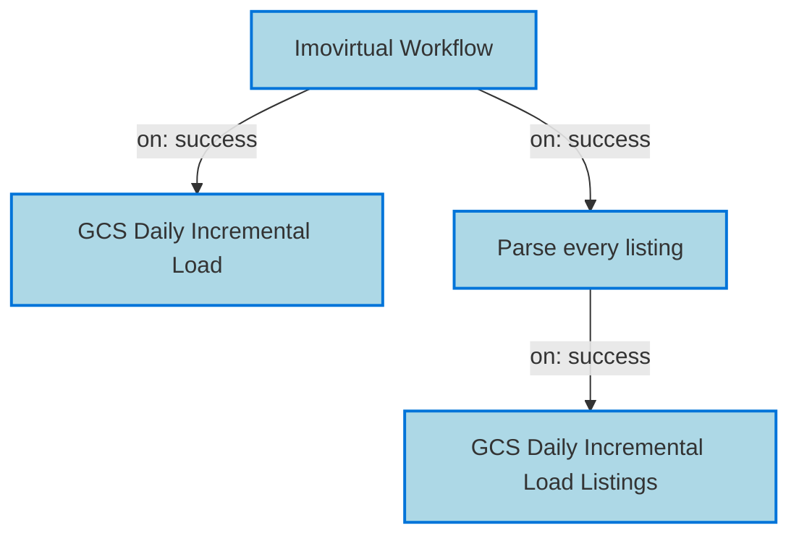
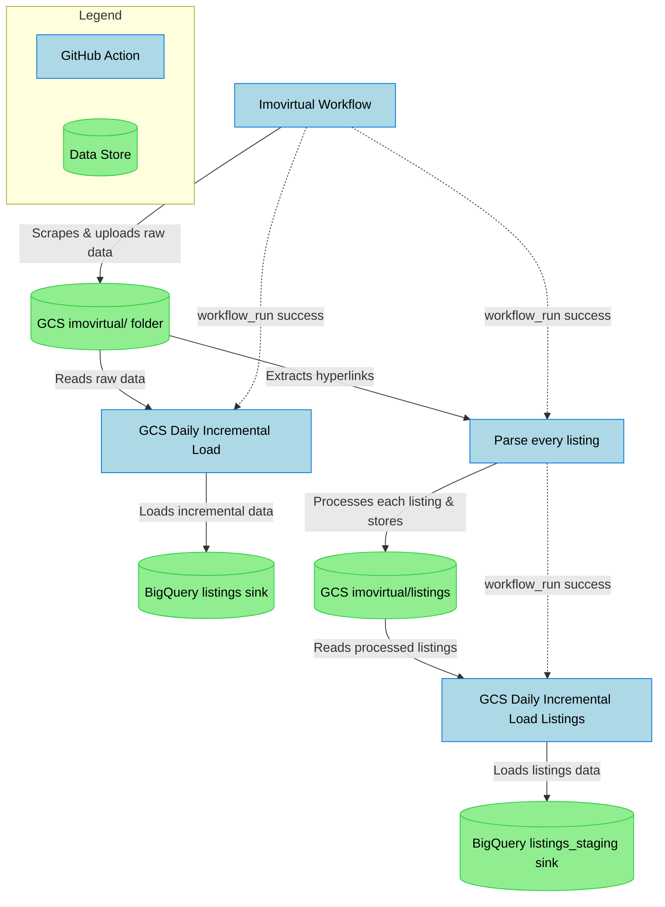

# Sequence diagram of data pipeline orchestration

```mermaid
graph TD
    %% Define workflow nodes
    IW[Imovirtual Workflow]
    GCSDIL[GCS Daily Incremental Load]
    PEL[Parse every listing]
    GCSDILL[GCS Daily Incremental Load Listings]
    
    %% Define dependencies with labels
    IW -->|"on: success"| GCSDIL
    IW -->|"on: success"| PEL
    PEL -->|"on: success"| GCSDILL
    
    %% Style the nodes
    classDef workflow fill:#ADD8E6,stroke:#0074D9,stroke-width:2px;
    class IW,GCSDIL,PEL,GCSDILL workflow;
```
---

```mermaid
flowchart TD
    %% Define styles
    classDef githubAction fill:#ADD8E6,stroke:#0074D9,color:black
    classDef dataStore fill:#90EE90,stroke:#2ECC40,color:black
    
    %% Define the main workflow steps
    IW[Imovirtual Workflow]
    GCSDIL[GCS Daily Incremental Load]
    PEL[Parse every listing]
    GCSDILL[GCS Daily Incremental Load Listings]
    
    %% Define data stores
    GCS_IMOV[(GCS imovirtual/ folder)]
    BQ_LISTINGS[(BigQuery listings sink)]
    GCS_LISTINGS[(GCS imovirtual/listings)]
    BQ_LISTINGS_STAGING[(BigQuery listings_staging sink)]
    
    %% Data flow
    IW -->|"Scrapes & uploads raw data"| GCS_IMOV
    
    GCS_IMOV -->|"Reads raw data"| GCSDIL
    GCSDIL -->|"Loads incremental data"| BQ_LISTINGS
    
    GCS_IMOV -->|"Extracts hyperlinks"| PEL
    PEL -->|"Processes each listing & stores"| GCS_LISTINGS
    
    GCS_LISTINGS -->|"Reads processed listings"| GCSDILL
    GCSDILL -->|"Loads listings data"| BQ_LISTINGS_STAGING
    
    %% Workflow dependencies
    IW -.->|"workflow_run success"| GCSDIL
    IW -.->|"workflow_run success"| PEL
    PEL -.->|"workflow_run success"| GCSDILL
    
    %% Apply styles
    class IW,GCSDIL,PEL,GCSDILL githubAction
    class GCS_IMOV,BQ_LISTINGS,GCS_LISTINGS,BQ_LISTINGS_STAGING dataStore
    
    %% Add legend
    subgraph Legend
    GA[GitHub Action]
    DS[(Data Store)]
    end
    
    class GA githubAction
    class DS dataStore
```