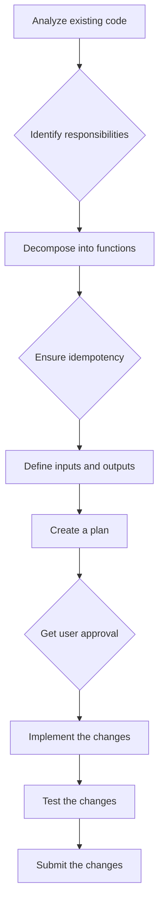

# Refactoring Plan for graphql_main.py

This plan outlines the steps for refactoring the `graphql_main.py` script to improve its structure, maintainability, and robustness. The refactoring will focus on applying the principles of functional decomposition, idempotency, and the single responsibility principle.

## Goals

*   Segment responsibilities to limit errors.
*   Ensure each task has a well-defined scope of input, output, and behavior.
*   Improve the overall structure and readability of the code.

## Plan

1.  **Analyze the existing code:** Understand the current script's functionality, inputs, and outputs.
2.  **Identify responsibilities:** Identify the different responsibilities of the script, such as:
    *   Fetching data from the API
    *   Retrying failed requests
    *   Saving data to disk
    *   Processing data for a single district
    *   Orchestrating the overall data fetching process
3.  **Decompose into functions:** Decompose the script into smaller, more focused functions, each with a single responsibility.
4.  **Ensure idempotency:** Ensure that each function is idempotent, meaning that it can be run multiple times without changing the result.
5.  **Define inputs and outputs:** Define the inputs and outputs for each function.
6.  **Create a detailed plan:** Create a detailed plan for how to rewrite the script, including a list of the functions that will be created, their responsibilities, their inputs, and their outputs.
7.  **Implement the changes:** Implement the changes, creating new files and modifying existing ones as necessary.
8.  **Test the changes:** Test the changes to ensure that they work as expected.
9.  **Submit the changes:** Submit the changes to the user.

## Mermaid Diagram

