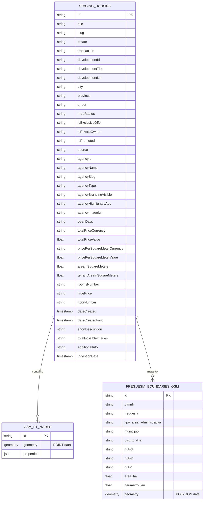

# Big Query data sinks

```mermaid
erDiagram
    STAGING_HOUSING ||--o{ OSM_PT_NODES : "contains"
    STAGING_HOUSING ||--o{ FREGUESIA_BOUNDARIES_OSM : "maps to"
    
    STAGING_HOUSING {
        string id PK
        string title
        string slug
        string estate
        string transaction
        string developmentId
        string developmentTitle
        string developmentUrl
        string city
        string province
        string street
        string mapRadius
        string isExclusiveOffer
        string isPrivateOwner
        string isPromoted
        string source
        string agencyId
        string agencyName
        string agencySlug
        string agencyType
        string agencyBrandingVisible
        string agencyHighlightedAds
        string agencyImageUrl
        string openDays
        string totalPriceCurrency
        float totalPriceValue
        string pricePerSquareMeterCurrency
        float pricePerSquareMeterValue
        float areaInSquareMeters
        float terrainAreaInSquareMeters
        string roomsNumber
        string hidePrice
        string floorNumber
        timestamp dateCreated
        timestamp dateCreatedFirst
        string shortDescription
        string totalPossibleImages
        string additionalInfo
        timestamp ingestionDate
    }
    
    FREGUESIA_BOUNDARIES_OSM {
        string id PK
        string dtmnfr
        string freguesia
        string tipo_area_administrativa
        string municipio
        string distrito_ilha
        string nuts3
        string nuts2
        string nuts1
        float area_ha
        float perimetro_km
        geometry geometry "POLYGON data"
    }
    
    OSM_PT_NODES {
        string id PK
        geometry geometry "POINT data"
        json properties
    }
```