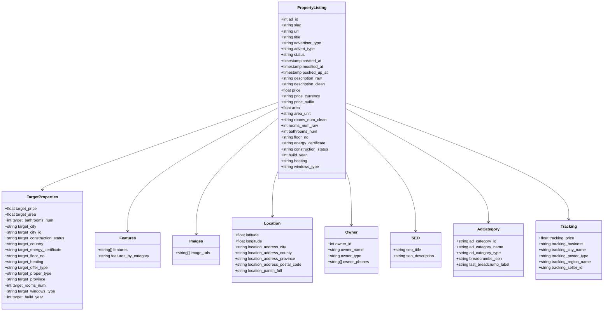

# Data structure

```mermaid
classDiagram
    class PropertyListing {
        +int ad_id
        +string slug
        +string url
        +string title
        +string advertiser_type
        +string advert_type
        +string status
        +timestamp created_at
        +timestamp modified_at
        +timestamp pushed_up_at
        +string description_raw
        +string description_clean
        +float price
        +string price_currency
        +string price_suffix
        +float area
        +string area_unit
        +string rooms_num_clean
        +int rooms_num_raw
        +int bathrooms_num
        +string floor_no
        +string energy_certificate
        +string construction_status
        +int build_year
        +string heating
        +string windows_type
    }

    class TargetProperties {
        +float target_price
        +float target_area
        +int target_bathrooms_num
        +string target_city
        +string target_city_id
        +string target_construction_status
        +string target_country
        +string target_energy_certificate
        +string target_floor_no
        +string target_heating
        +string target_offer_type
        +string target_proper_type
        +string target_province
        +int target_rooms_num
        +string target_windows_type
        +int target_build_year
    }

    class Features {
        +string[] features
        +string features_by_category
    }

    class Images {
        +string[] image_urls
    }

    class Location {
        +float latitude
        +float longitude
        +string location_address_city
        +string location_address_county
        +string location_address_province
        +string location_address_postal_code
        +string location_parish_full
    }

    class Owner {
        +int owner_id
        +string owner_name
        +string owner_type
        +string[] owner_phones
    }

    class SEO {
        +string seo_title
        +string seo_description
    }

    class AdCategory {
        +string ad_category_id
        +string ad_category_name
        +string ad_category_type
        +string breadcrumbs_json
        +string last_breadcrumb_label
    }

    class Tracking {
        +float tracking_price
        +string tracking_business
        +string tracking_city_name
        +string tracking_poster_type
        +string tracking_region_name
        +string tracking_seller_id
    }

    PropertyListing --> TargetProperties
    PropertyListing --> Features
    PropertyListing --> Images
    PropertyListing --> Location
    PropertyListing --> Owner
    PropertyListing --> SEO
    PropertyListing --> AdCategory
    PropertyListing --> Tracking
```